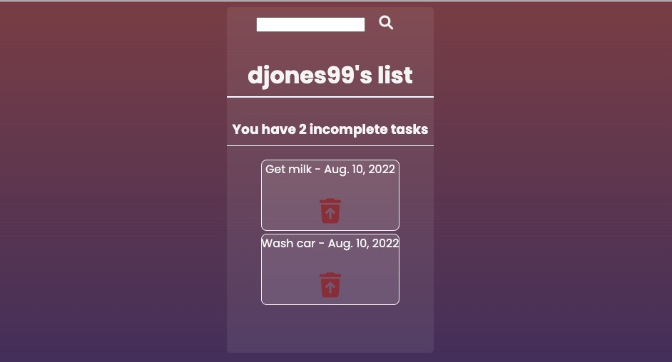

# RemindMe

## Getting Started: 
**[ (Plan Link)](https://trello.com/b/ewoDHSvq/remindme)** 
**[ (Deploy Link)](https://remind-me-main.herokuapp.com/)**  

## Technologies Used: 
      
  

## ScreenShot of Home

## Next Steps

Perhaps implement the openweather API to utilze with doing tasks outdoors.

